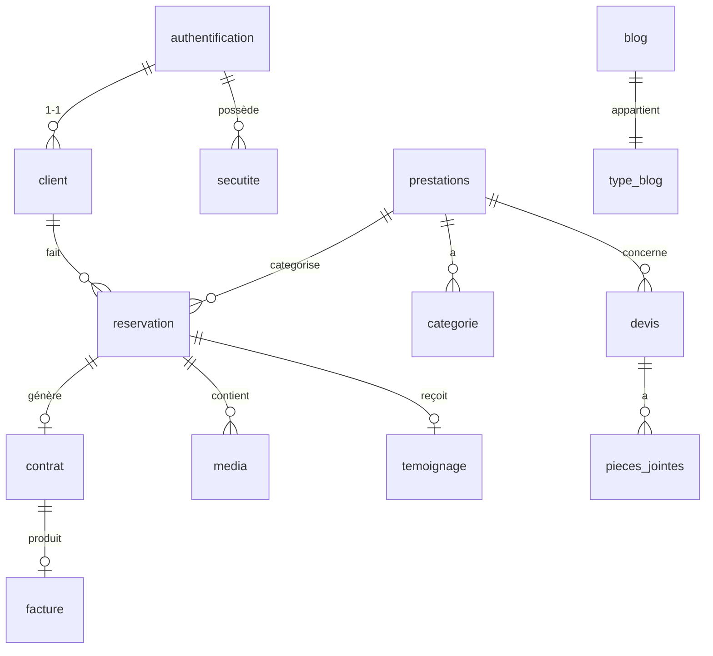

# 📋 Plan des fonctionnalités manquantes — NY TIA SARY

## Vue d'ensemble de la base de données

La BDD contient **14 tables** organisées ainsi :

---

## ✅ Ce qui est déjà implémenté

| Page | Fonctionnalité |
|------|---------------|
| `client/reservations.php` | Création de réservation, liste filtrée par statut |
| `admin/reservations.php` | Liste + changement de statut (AJAX) + recherche |
| `admin/prestations.php` | CRUD complet (create/edit/delete) avec protection |
| `admin/clients.php` | Gestion des clients |
| `admin/devis.php` | Gestion des devis |
| `admin/blog.php` | Gestion du blog |
| `client/devis.php` | Formulaire de devis côté client |
| `client/parametres.php` | Paramètres du profil client |
| `admin/parametres.php` | Paramètres admin |

---

## ❌ Ce qui manque à implémenter

### 🔴 PRIORITÉ HAUTE — Fonctionnalités cœur métier

---

#### 1. `categorie` — Sous-catégories de prestations (ADMIN)
> Table `categorie` (ID_CATEGORIE, ID_PRESTATION, LIB_CATEGORIE, TARIF_CATEGORIE) existe mais **aucune page ne la gère**.

**À créer :** `espace/admin/categories.php`
- [ ] Lister les catégories groupées par prestation
- [ ] Ajouter une catégorie (nom + tarif) liée à une prestation
- [ ] Modifier une catégorie
- [ ] Supprimer une catégorie
- [ ] **Côté client :** sélection dynamique de la catégorie après avoir choisi la prestation (formulaire réservation)

**Impact :** Sans ça, le client ne voit pas les tarifs et ne peut pas choisir une sous-prestation précise.

---

#### 2. `contrat` — Génération de contrat après confirmation (ADMIN)
> Table `contrat` (ID_CONTRAT, ID_RESERVATION, DATE_CONTRAT) existe mais **aucune page ne la gère**.

**À créer/compléter :**
- [ ] Dans `admin/reservations.php` : quand statut passe à CONFIRMEE, proposer de créer un contrat
- [ ] Afficher une icône si un contrat existe déjà pour une réservation
- [ ] `admin/contrats.php` : liste des contrats avec lien vers la facture

---

#### 3. `facture` — Gestion des factures (ADMIN + CLIENT)
> Table `facture` (ID_FACTURE, ID_CONTRAT, NUM_FACTURE, DATE_FACTURE) existe mais **aucune page ne la crée ou l'affiche**.

**À créer :** `espace/admin/factures.php`
- [ ] Créer une facture liée à un contrat
- [ ] Générer automatiquement un numéro de facture (ex: `FAC-2026-0001`)
- [ ] Lister toutes les factures
- [ ] **Bonus :** export PDF

**Côté client :**
- [ ] Page `client/mes_factures.php` ou onglet dans réservations pour voir ses factures

---

#### 4. `temoignage` — Système d'avis/notes (CLIENT + ADMIN)
> Table `temoignage` (ID_TEMOIGNAGE, ID_RESERVATION, MESS_RESERVATION, NOTE) existe mais **aucune interface ne permet d'en créer ou afficher**.

**À créer :**
- [ ] Dans `client/reservations.php` : bouton "Laisser un avis" si statut = TERMINEE
- [ ] Modal : note en étoiles (1-5) + message
- [ ] `admin/temoignages.php` : liste des avis avec modération
- [ ] Affichage sur la page publique

---

#### 5. `media` — Livraison de photos/vidéos (ADMIN + CLIENT)
> Table `media` (ID_MEDIA, ID_RESERVATION, PATH_MEDIA, TYPE_MEDIA) existe mais `mes_photos.php` et `mes_videos.php` sont des **squelettes vides**.

**À créer/compléter :**
- [ ] `admin/medias.php` : upload de photos/vidéos liés à une réservation terminée
- [ ] `client/mes_photos.php` : galerie des photos livrées (filtrer par réservation)
- [ ] `client/mes_videos.php` : player ou téléchargement des vidéos livrées

---

### 🟡 PRIORITÉ MOYENNE — Notifications & UX

---

#### 6. `notification` — Système de notifications
> Table `notification` (LU_NOTIF, SUP_NOTIF, TITRE_NOTIF...) existe mais **rien n'envoie ni ne lit ces notifications**.

**À implémenter :**
- [ ] Insérer une notification auto quand : client réserve → notif admin; admin change statut → notif client
- [ ] Icône cloche dans la topbar (admin + client) avec compteur non-lues
- [ ] Dropdown ou page listant les notifications

---

#### 7. `admin/calendrier.php` — Calendrier des réservations
> Le fichier existe (1365 octets — squelette) mais est **non implémenté**.

**À compléter :**
- [ ] Vue calendrier mensuelle avec les réservations confirmées
- [ ] Colorisation par type de prestation
- [ ] Clic sur une réservation → détail

---

#### 8. Client — Annulation de réservation
> Le client peut voir ses réservations mais **ne peut pas les annuler**.

**Dans `client/reservations.php` :**
- [ ] Bouton "Annuler" visible uniquement si statut = EN ATTENTE
- [ ] Confirmation avant annulation
- [ ] Mise à jour du statut en BDD

---

#### 9. Client — Détail d'une réservation
> Le tableau client affiche les infos de base mais **pas le commentaire, contrat, facture ni médias**.

**Dans `client/reservations.php` :**
- [ ] Clic sur une ligne → modal ou page de détail
- [ ] Afficher : commentaire, contrat, facture, médias livrés

---

### 🟢 PRIORITÉ BASSE — Bugs & améliorations

---

#### 10. ⚠️ Bug critique : incohérence des valeurs ENUM statut
> La BDD déclare `STATUS_RESERVATION ENUM('EN ATTENTE','CONFIRMEE','ANNULEE','TERMINEE')` **(sans accents)**  
> Mais le code PHP utilise `'CONFIRMÉ'`, `'ANNULÉ'`, `'TERMINÉ'` **(avec accents)** → les mises à jour échouent silencieusement.

**À corriger :**
- [ ] Aligner le PHP sur les ENUM de la BDD : `CONFIRMEE`, `ANNULEE`, `TERMINEE`
- [ ] Corriger dans `client/reservations.php` (ligne 138) et `admin/reservations.php` (lignes 15, 87, 127)

---

#### 11. Catégories dynamiques dans le formulaire de réservation client
> La table `categorie` avec `TARIF_CATEGORIE` n'est **jamais utilisée** dans le formulaire de réservation.

**À améliorer :**
- [ ] Après sélection prestation → charger en AJAX les catégories disponibles
- [ ] Afficher le tarif estimatif de la catégorie choisie

---

#### 12. Dashboard admin — Stats incomplètes
> `admin/home.php` ne montre probablement pas les contrats, factures ni revenus.

**À ajouter :**
- [ ] Stat : contrats signés ce mois
- [ ] Stat : factures émises + total revenus estimés
- [ ] Graphique réservations par mois (Chart.js)

---

## 📊 Résumé priorisé

| # | Fonctionnalité | Tables | Priorité | Complexité |
|---|---------------|--------|----------|------------|
| 1 | Catégories de prestations (CRUD admin + client) | `categorie` | 🔴 Haute | Moyenne |
| 2 | Génération de contrat | `contrat` | 🔴 Haute | Moyenne |
| 3 | Gestion des factures | `facture` | 🔴 Haute | Haute |
| 4 | Témoignages / avis clients | `temoignage` | 🔴 Haute | Faible |
| 5 | Livraison médias photos/vidéos | `media` | 🔴 Haute | Haute |
| 6 | Système de notifications | `notification` | 🟡 Moyenne | Moyenne |
| 7 | Calendrier des réservations | `reservation` | 🟡 Moyenne | Haute |
| 8 | Annulation de réservation (client) | `reservation` | 🟡 Moyenne | Faible |
| 9 | Détail d'une réservation (client) | `reservation`, `contrat`, `facture` | 🟡 Moyenne | Faible |
| 10 | **Fix bug ENUM statuts** (critique) | `reservation` | 🟢 Basse | Faible |
| 11 | Catégories dynamiques formulaire | `categorie` | 🟢 Basse | Moyenne |
| 12 | Stats dashboard admin améliorées | multiple | 🟢 Basse | Moyenne |

> Vous pouvez me dire par quel item vous voulez commencer et je l'implémente immédiatement.
